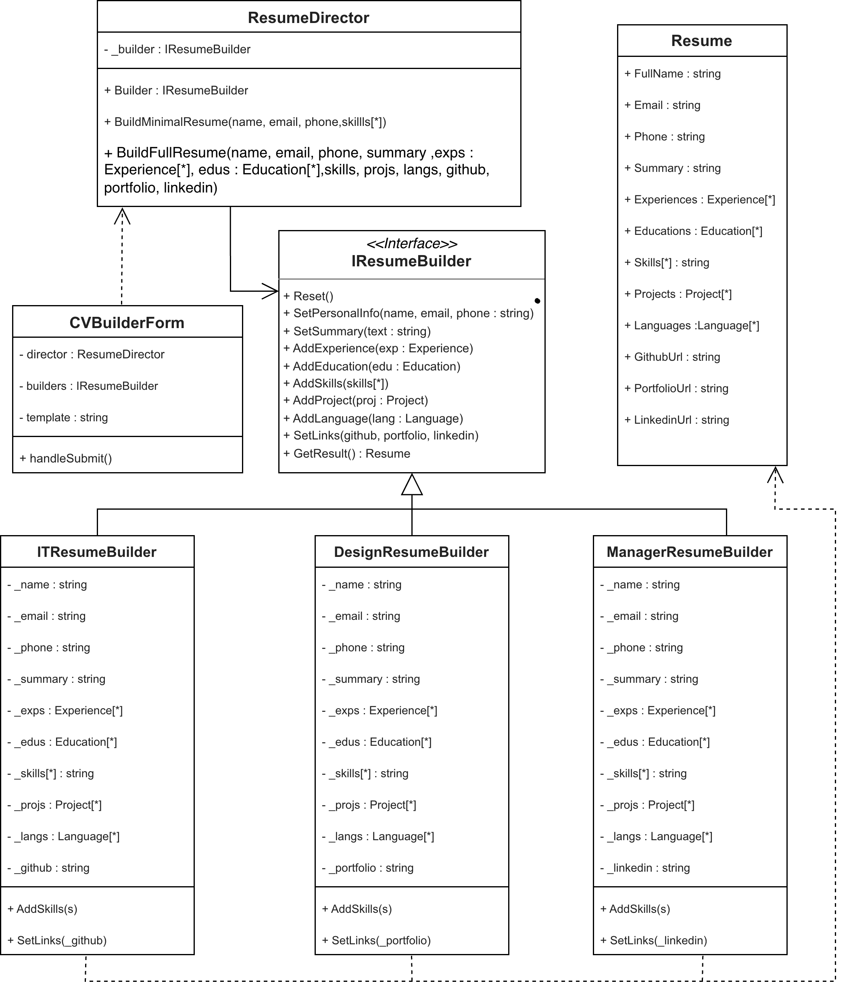

# Лабораторная работа №1

**Тема:** Порождающий паттерн Builder   
**Дисциплина:** Объектно-ориентированный анализ и проектирование  
**Студент:** Анишко Руслан, 932304  
**Проект:** CV Builder — конструктор резюме

---

## 1. Цель работы

Изучить и реализовать порождающий паттерн проектирования **Builder**  на примере приложения для создания резюме (CV). Сравнить реализацию с подходом без применения паттерна.

## 2. Описание предметной области

Приложение **CV Builder** позволяет пользователю создавать резюме на основе выбранного шаблона (IT-специалист, Дизайнер, Менеджер). Каждый шаблон автоматически настраивает навыки и ссылки, характерные для конкретной профессии.

Стек технологий:
- **Backend:** C# ASP.NET Core 8 (.NET 8)
- **Frontend:** React 18 + Vite 5 + Mantine 7
- **Экспорт:** Markdown (.md), Word (.docx)

## 3. Паттерн Builder

**Builder** — порождающий паттерн проектирования, который позволяет создавать сложные объекты пошагово. Паттерн даёт возможность использовать один и тот же код конструирования для получения различных представлений объектов.

### 3.1 Участники паттерна

| Роль GoF | Класс / интерфейс | Файл | Описание |
|---|---|---|---|
| **Builder** | `IResumeBuilder` | `Builders/IResumeBuilder.cs` | Интерфейс: 10 шагов конструирования |
| **ConcreteBuilder** | `ITResumeBuilder` | `Builders/ITResumeBuilder.cs` | IT-специалист: авто-добавляет Git, Linux; GitHub URL |
| **ConcreteBuilder** | `DesignResumeBuilder` | `Builders/DesignAndManagerBuilders.cs` | Дизайнер: авто-добавляет Figma, Adobe CC; Portfolio URL |
| **ConcreteBuilder** | `ManagerResumeBuilder` | `Builders/DesignAndManagerBuilders.cs` | Менеджер: авто-добавляет Leadership, Agile/Scrum; LinkedIn URL |
| **Director** | `ResumeDirector` | `Director/ResumeDirector.cs` | Два рецепта: `BuildMinimalResume`, `BuildFullResume` |
| **Product** | `Resume` | `Models/Resume.cs` | Иммутабельный результат, 12 readonly-свойств, internal конструктор |
| **Client** | `ResumeController` | `Controllers/ResumeController.cs` | HTTP API, выбор Builder'а по шаблону через Dictionary |

### 3.2 UML-диаграмма классов

На Рисунке 1 представлена UML-диаграмма классов проекта CVBuilder.Api, отражающая структуру паттерна Builder. Диаграмма показывает интерфейс `IResumeBuilder` (Builder), три конкретных строителя — `ITResumeBuilder`, `DesignResumeBuilder`, `ManagerResumeBuilder` (ConcreteBuilder), директора `ResumeDirector` (Director), продукт `Resume` (Product) и клиента `ResumeController`.

Строители реализуют интерфейс `IResumeBuilder` (связь реализации) и создают объект `Resume` через вызов `new Resume(...)` в методе `GetResult()` (зависимость «create»). Директор хранит ссылку на `IResumeBuilder` и управляет последовательностью вызовов шагов. Клиент `ResumeController` выбирает нужного строителя из словаря `Dictionary<string, IResumeBuilder>` и передаёт его директору.



*Рисунок 1 — UML-диаграмма классов паттерна Builder*

### 3.3 Связи на диаграмме

- **ResumeController → ResumeDirector** — ассоциация (поле `_director`)
- **ResumeController ··→ IResumeBuilder** — зависимость (`Dictionary<string, IResumeBuilder>`)
- **ResumeDirector → IResumeBuilder** — ассоциация (поле `_builder`)
- **IT / Design / Manager ResumeBuilder ··▷ IResumeBuilder** — реализация интерфейса
- **Builders ··→ Resume** — зависимость «create» (`new Resume(...)` в `GetResult()`)
- **Resume ◆→ Experience, Education, Project, Language** — композиция (`IReadOnlyList`)

## 4. Сравнение подходов

В проекте реализованы два бэкенда для сравнения:

| Критерий | С паттерном (`CVBuilder.Api`) | Без паттерна (`CVBuilder.NoPattern.Api`) |
|---|---|---|
| Конструирование | Пошаговое через Builder + Director | Телескопический конструктор |
| Расширяемость | Новый Builder — новый класс | Дублирование кода в контроллере |
| Иммутабельность Product | `Resume` — readonly, internal ctor | Мутабельный объект |
| Количество методов контроллера | 1 универсальный `Build()` | 3 метода `Create*Resume()` с дублированием |

## 5. Структура проекта

```
932304.anishko.ruslan.builder-pattern/
├── backend/
│   ├── CVBuilder.Api/              — С паттерном Builder
│   └── CVBuilder.NoPattern.Api/    — Без паттерна (для сравнения)
└── frontend/
    ├── public/
    │   └── builder.drawio.png      — UML-диаграмма (Рисунок 1)
    └── src/                        — React SPA (презентация + демо)
```

## 6. Запуск

### Backend с паттерном (порт 5000)
```bash
cd backend/CVBuilder.Api
dotnet run
```

### Backend без паттерна (порт 5001)
```bash
cd backend/CVBuilder.NoPattern.Api
dotnet run
```

### Frontend
```bash
cd frontend
npm install && npm run dev
# http://localhost:5173
```

## 7. Вывод

В ходе выполнения лабораторной работы был реализован порождающий паттерн **Builder** (GoF) на примере конструктора резюме. Паттерн позволил:
- отделить конструирование сложного объекта `Resume` от его представления;
- создавать различные варианты резюме (IT, Дизайн, Менеджер) с помощью одного и того же процесса конструирования;
- обеспечить иммутабельность и целостность продукта.

Сравнение с реализацией без паттерна наглядно продемонстрировало преимущества Builder в плане расширяемости, устранения дублирования кода и соблюдения принципов SOLID.
