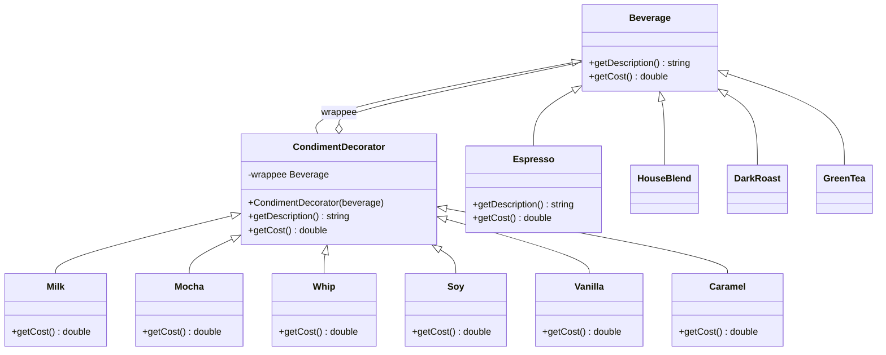

# Лабораторная работа № 2 — Паттерн Decorator

**Студент:** Анишко Руслан, 932304  
**Паттерн:** Decorator (Декоратор) — структурный паттерн  
**Стек:** C++17 · CMake · cpp-httplib · nlohmann/json · React 18 · Vite 5 · Mantine 7

---

## 1. Постановка задачи

Реализовать конфигуратор напитков кофейни двумя способами:

| Вариант | Описание |
|---|---|
| **Без паттерна** | Монолитный `struct Beverage` с булевыми флагами для каждой добавки |
| **С паттерном** | Иерархия классов Decorator: компонент оборачивается декораторами |

---

## 2. Паттерн Decorator

**Decorator** — структурный паттерн, который динамически добавляет объекту новые обязанности, оборачивая его в объект-декоратор, реализующий тот же интерфейс.

> Альтернатива созданию подклассов для каждой комбинации функциональностей.

### Участники паттерна

| Роль | Класс в проекте |
|---|---|
| **Component** | `Beverage` — абстрактный базовый класс напитка |
| **ConcreteComponent** | `Espresso`, `HouseBlend`, `DarkRoast`, `GreenTea` |
| **Decorator** | `CondimentDecorator` — хранит `wrappee: Beverage`, делегирует вызовы |
| **ConcreteDecorator** | `Milk`, `Mocha`, `Whip`, `Caramel`, `Vanilla`, `Soy` |
| **Client** | `main()` — HTTP-обработчик, собирает цепочку декораторов |

---

## 3. UML-диаграмма



### Ключевые связи

| Связь | Тип | Описание |
|---|---|---|
| `Espresso/HouseBlend/...` → `Beverage` | Generalization (сплошная + △) | Наследование абстрактного класса |
| `CondimentDecorator` → `Beverage` | Generalization (сплошная + △) | Декоратор сам является Beverage |
| `CondimentDecorator` ◇── `Beverage` | Aggregation (сплошная + ◇) | Поле `wrappee` — оборачиваемый объект |
| `Milk/Mocha/...` → `CondimentDecorator` | Generalization (сплошная + △) | Конкретные декораторы |

---

## 4. Проблема без паттерна

```cpp
// ⚠ Все добавки — булевы поля в базовом классе
struct Beverage {
    bool hasMilk    = false;   // +0.30
    bool hasMocha   = false;   // +0.50
    bool hasWhip    = false;   // +0.40
    bool hasCaramel = false;   // +0.45
    // ...хочешь новую добавку? Добавь поле + измени getCost() + getDescription()

    double getCost() const {
        double total = baseCost;
        if (hasMilk)    total += 0.30;  // ⚠ растёт с каждой добавкой
        if (hasMocha)   total += 0.50;
        // ...
        return total;
    }
};
```

**Нарушения:**
- **OCP** — добавление новой добавки требует изменения базового класса
- **God Object** — один класс отвечает за всё
- Нельзя добавить двойной мокко (`bool` = только один раз)
- Комбо-напитки жёстко захардкожены

---

## 5. Решение с паттерном Decorator

### Component

```cpp
// Beverage.h — абстрактный базовый класс
class Beverage {
public:
    virtual ~Beverage() = default;
    virtual std::string getDescription() const = 0;
    virtual double      getCost()        const = 0;
};
```

### ConcreteComponent

```cpp
// ConcreteComponents.h
class Espresso : public Beverage {
public:
    std::string getDescription() const override { return "Эспрессо"; }
    double      getCost()        const override { return 1.99; }
};
```

### Decorator

```cpp
// CondimentDecorator.h
class CondimentDecorator : public Beverage {
protected:
    std::unique_ptr<Beverage> beverage_;  // wrappee
public:
    explicit CondimentDecorator(std::unique_ptr<Beverage> b)
        : beverage_(std::move(b)) {}
};
```

### ConcreteDecorator

```cpp
// ConcreteDecorators.h
class Milk : public CondimentDecorator {
public:
    using CondimentDecorator::CondimentDecorator;
    std::string getDescription() const override {
        return beverage_->getDescription() + " + Молоко";
    }
    double getCost() const override {
        return beverage_->getCost() + 0.30;  // делегирует + добавляет
    }
};
```

### Client — сборка цепочки

```cpp
// Создаём ConcreteComponent
std::unique_ptr<Beverage> drink = std::make_unique<Espresso>();

// Оборачиваем декораторами
drink = std::make_unique<Milk>(std::move(drink));   // +0.30
drink = std::make_unique<Mocha>(std::move(drink));  // +0.50
drink = std::make_unique<Mocha>(std::move(drink));  // +0.50 (двойной!)

// Полиморфный вызов проходит по всей цепочке
std::cout << drink->getDescription();  // Эспрессо + Молоко + Мокко + Мокко
std::cout << drink->getCost();         // 1.99 + 0.30 + 0.50 + 0.50 = 3.29
```

---

## 6. Сравнение подходов

| Критерий | Без паттерна | С паттерном |
|---|---|---|
| Новая добавка | Изменить `Beverage` | Новый класс, 0 изменений |
| Двойная добавка | Невозможно (bool) | `Mocha(Mocha(drink))` |
| OCP | Нарушен | Соблюдён |
| Размер кода | Растёт экспоненциально | Линейный рост |
| Тестируемость | Сложно (зависимости) | Каждый класс изолированно |

---

## 7. Структура проекта

```
932304.anishko.ruslan.decorator-pattern/
├── backend-no-pattern/        # Без паттерна
│   ├── CMakeLists.txt
│   └── main.cpp               # Монолитный Beverage с bool-флагами
│
├── backend-with-pattern/      # С паттерном Decorator
│   ├── CMakeLists.txt
│   ├── main.cpp               # Client (HTTP-сервер, сборка цепочки)
│   └── include/
│       ├── Beverage.h         # Component
│       ├── ConcreteComponents.h  # Espresso, HouseBlend, DarkRoast, GreenTea
│       ├── CondimentDecorator.h  # Decorator (wrappee)
│       └── ConcreteDecorators.h  # Milk, Mocha, Whip, Caramel, Vanilla, Soy
│
└── frontend/                  # React 18 + Vite + Mantine
    └── src/sections/
        ├── SectionDemo.jsx    # Интерактивная форма заказа
        ├── SectionIdea.jsx    # Идея и участники паттерна
        ├── SectionUml2.jsx    # UML-диаграмма с паттерном
        ├── SectionCode1.jsx   # Код без паттерна
        ├── SectionCode2.jsx   # Код с паттерном
        └── SectionEnd.jsx     # Вывод и сравнение
```

---

## 8. Запуск

### Backend (с паттерном)

```bash
cd backend-with-pattern
cmake -B build
cmake --build build
./build/coffee_server        # http://localhost:5000
```

### Backend (без паттерна)

```bash
cd backend-no-pattern
cmake -B build
cmake --build build
./build/coffee_server_no_pattern
```

### Frontend

```bash
cd frontend
npm install
npm run dev                  # http://localhost:5173
```

> Frontend проксирует `/api` → `http://localhost:5000`.
> Если бэкенд не запущен, используется встроенная JS-логика (fallback).

---

## 9. Выводы

1. **Open/Closed Principle** — `Beverage` и `CondimentDecorator` закрыты для изменений, открыты для расширения новыми декораторами.
2. **Композиция вместо наследования** — вместо N×M подклассов — N компонентов + M декораторов.
3. **Single Responsibility** — каждый декоратор отвечает ровно за одну добавку.
4. **Рекурсивная структура** — `getCost()` проходит по всей цепочке автоматически.
5. **Гибкость** — одна добавка может применяться несколько раз (двойной мокко).

