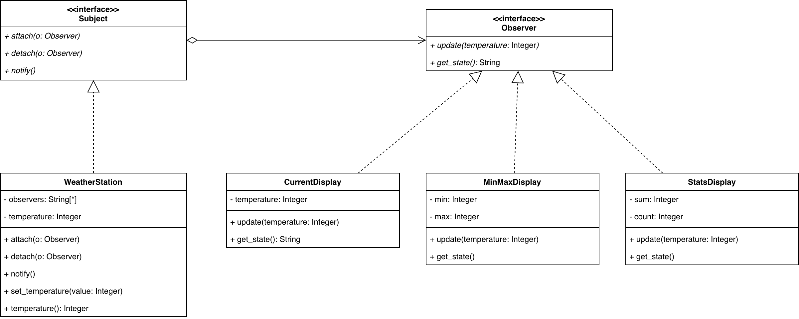

# Отчёт по лабораторной работе №3

## Тема
Поведенческий паттерн проектирования **Observer** (Наблюдатель).

## Цель
Реализовать одну и ту же предметную область двумя способами — с применением
паттерна Observer и без него — и на практике увидеть разницу в гибкости и
связанности кода.

## Идея проекта
Мини-система «Погодная станция». Имеется объект-источник данных, который
хранит текущую температуру. Кроме него есть несколько дисплеев, которые
должны реагировать на её изменение:

- **CurrentDisplay** — показывает текущую температуру;
- **MinMaxDisplay** — хранит минимум и максимум за всё время;
- **StatsDisplay** — считает среднее и число измерений.

Пользователь задаёт температуру через UI, и все дисплеи моментально
обновляются.

## Реализация с паттерном Observer

Классическая UML-структура:

- `Subject` (абстрактный) — методы `attach`, `detach`, `notify`;
- `Observer` (абстрактный) — метод `update`;
- `WeatherStation` реализует `Subject`, хранит список подписчиков и при
  изменении температуры вызывает `notify()`, который дёргает `update()` у
  каждого;
- `CurrentDisplay`, `MinMaxDisplay`, `StatsDisplay` реализуют `Observer` и
  сами решают, как реагировать на новое значение.

Диаграмма (PNG):



Ключевой фрагмент:

```python
def set_temperature(self, value: float) -> None:
    self._temperature = value
    self.notify()           # ← вся магия здесь
```

`WeatherStation` не знает, какие именно дисплеи к ней подключены и что они
делают с температурой. Новый наблюдатель добавляется в одну строчку:

```python
station.attach(MyNewDisplay())
```

## Реализация без паттерна

Всё состояние хранится в одном глобальном словаре, а функция
`set_temperature` вручную пересчитывает min, max, sum и count:

```python
def set_temperature(value: float) -> None:
    state["temperature"] = value
    if state["min"] is None or value < state["min"]:
        state["min"] = value
    ...
    state["sum"] += value
    state["count"] += 1
```

Работает — но:

1. **Сильная связанность.** Функция знает про все виды обработки. Чтобы
   добавить четвёртый «дисплей» (например, уведомление в Telegram),
   нужно лезть в `set_temperature` и дописывать туда ещё одну ветку.
2. **Нарушение принципа единственной ответственности.** Одна функция
   отвечает и за хранение, и за статистику, и за min/max.
3. **Тестировать это тяжело.** Каждое поведение нельзя протестировать в
   изоляции — всё связано через общий словарь.

Версия с паттерном всё это решает: каждый `Observer` — независимый класс
со своей логикой, а `WeatherStation` занимается только оповещением.

## Фронтенд

React + Mantine + Vite. Один компонент `App.jsx`:

- `SegmentedControl` переключает базовый URL между двумя бэкендами;
- `NumberInput` + `Button` отправляют температуру вручную;
- кнопка «Случайная» генерирует значение на бэкенде;
- кнопка «Томск (реальная)» запрашивает у бэкенда актуальную
  температуру Томска, а бэкенд тянет её из Open-Meteo;
- три карточки отображают состояние наблюдателей;
- данные подтягиваются каждую секунду через `setInterval`.

Цвет бейджа в шапке меняется в зависимости от выбранного бэкенда —
чтобы визуально подтвердить переключение.

## Реальная температура Томска

В обоих бэкендах есть endpoint `POST /tomsk`. Он делает HTTP-запрос
к Open-Meteo (`https://api.open-meteo.com/v1/forecast`) с координатами
Томска (≈ 56.50, 84.97) и параметром `current_weather=true`, достаёт
поле `current_weather.temperature` и отдаёт его в `WeatherStation`
(или в глобальное состояние во втором варианте). Далее всё работает
по тем же правилам: в версии с паттерном Subject сам оповещает
наблюдателей, в версии без — функция вручную пересчитывает min/max/avg.

API не требует ключа и бесплатен. Если сеть недоступна, бэкенд
возвращает 502 с пояснением, а фронт показывает красный Alert.
Ручной ввод и «Случайная» остаются как были — это три независимых
способа «подкинуть» новое значение в одну и ту же систему.

## Выводы

Паттерн Observer — простой и очень распространённый. Он применим везде,
где один объект должен уведомлять множество других о своих изменениях
без жёсткой связи с ними. На этой маленькой задаче он выглядит почти
избыточным, но его ценность проявляется в момент, когда нужно добавить
нового слушателя: в версии с паттерном это одна строка, в версии без —
правка существующей функции (и риск что-то сломать).
