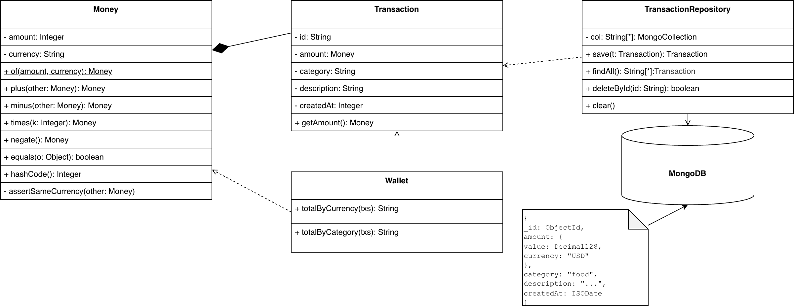

# Лабораторная работа №4 — Паттерн Value Object

**Паттерн:** Value Object 

Реализация «мультивалютный кошелёк» двумя способами: с применением паттерна Value Object и без него.

## Что такое Value Object

Value Object (объект-значение) — паттерн из книги Мартина Фаулера *Patterns of Enterprise Application Architecture*. Его идея проста: некоторые объекты не имеют собственной идентичности — важно только то, что они содержат. Классические примеры: деньги, дата, координаты, цвет.

Три обязательных свойства:

- **Равенство по значению** — два объекта равны, если равны их поля, а не ссылки на них. `10 USD == 10 USD` независимо от того, один это экземпляр или два разных.
- **Иммутабельность** — объект нельзя изменить после создания. Любая операция возвращает новый объект.
- **Самовалидация** — объект сам проверяет корректность при создании и операциях (например, нельзя сложить USD и RUB).

## Идея проекта

Центральный объект — деньги: сумма и валюта неотделимы друг от друга. Именно эта пара является кандидатом на Value Object. В версии с паттерном она оформлена в класс `Money`; в версии без паттерна — хранится двумя независимыми полями, и программист сам следит за их согласованностью.

## UML-диаграмма

## Реализация с паттерном

Класс `Money` (`backend-value-object/.../Money.java`) обладает следующими свойствами:

- **Иммутабельность** — поля `final`, арифметика возвращает новые объекты.
- **Равенство по значению** — `equals`/`hashCode` сравнивают сумму и валюту; применяется `BigDecimal.compareTo`, чтобы `10.0 USD == 10.00 USD`.
- **Самовалидация** — метод `plus` выбрасывает `CurrencyMismatchException` при несовпадении валют.
- **Инкапсулированная арифметика** — методы `plus`, `minus`, `times`, `negate`; сервисный слой не работает напрямую с `BigDecimal`.

Сериализация в MongoDB: вложенный документ `{ value: Decimal128, currency: "USD" }`.

## Реализация без паттерна

`Transaction` хранит `double amount` и `String currency` как независимые поля. Следствия:

1. Корректность совместного использования полей не гарантируется типом — её обеспечивает только дисциплина разработчика.
2. Логика формирования денежного значения дублируется в каждой точке сериализации и агрегации.
3. Использование `double` вместо `BigDecimal` создаёт риск погрешности округления.

## Выводы

Паттерн Value Object на примере класса `Money`:

- переводит инвариант «сумма неотделима от валюты» в свойство системы типов;
- локализует всю денежную логику в одном классе, устраняя дублирование;
- обеспечивает корректное поведение в коллекциях через `equals`/`hashCode`;
- сохраняет структурную целостность при сериализации в документоориентированную БД.

Версия без паттерна функционально эквивалентна, однако требует ручного контроля инвариантов в каждой новой точке использования.
